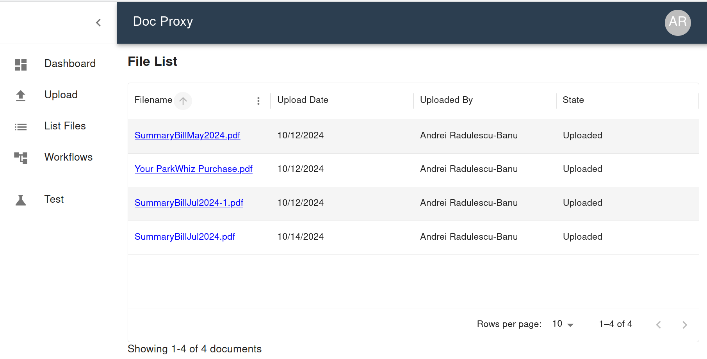

# doc-proxy

We implement a Smart Document Router. When completed, the router will use LLMs to route documents to the appropriate handlers, and to process the documents according to configured workflows.

Tech stack:
* NextJS, NextAuth
* FastAPI
* MongoDB
* Pydantic

Example display of Smart Document Router docs:


# Local development environment

## Linux Fedora
* MongoDB setup
  * [Install MongoDB](https://medium.com/@nkav2447/how-to-download-and-install-mongodb-on-fedora-40-2db148a7c2f0)
  * Create `pdf_manager` database, `users` collection
* Create venv for doc-proxy, install `backend/requirements.txt`
  * During setup
  ```bash
  mkdir ~/.venv
  python -m venv ~/.venv/doc-proxy
  . ~/.venv/doc-proxy/bin/activate
  pip install -r source/requirements.txt
  ```
  * When running: `. ~/.venv/doc-proxy/bin/activate`

* Start the back end
  ```bash
  cd backend/app
  uvicorn main:app --host 0.0.0.0 --port 8000
  ```
  * To test in Swagger UI, open [http://localhost:8000/docs], authenticate with a user token, and execute any API calls.
* Open [http://localhost:8000/docs] to experiment with the FastAPI
* Start the front end
  ```bash
  cd frontend
  npm run dev
  ```

## Macbook
TO DO